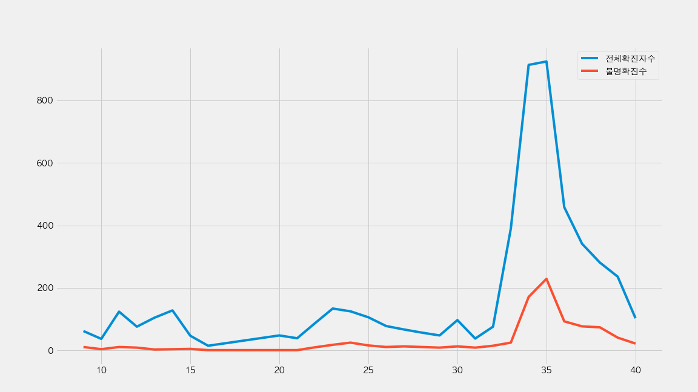
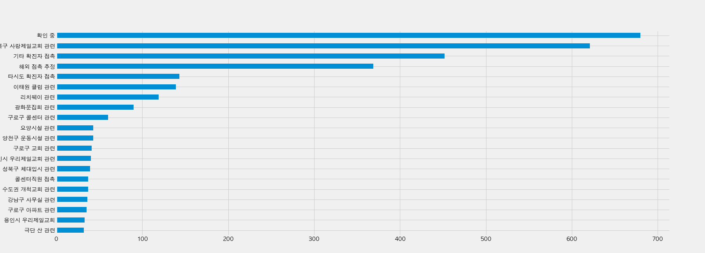
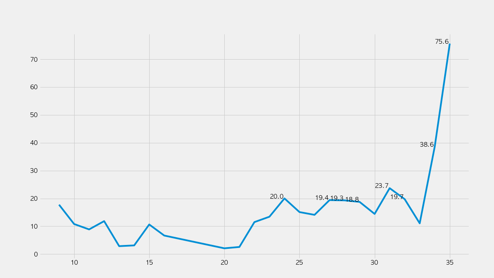

# Covid19 Unknown Spread in Seoul

## [What's the trend of untracked Covid19 patients in Seoul?](https://nbviewer.jupyter.org/github/snoop2head/covid19_unknown_spread/blob/master/Seoul-Covid19.ipynb)

Visualizing Seoul's untracked Covid19 patients out of daily confirmed cases. 

* [Data Collection Reference](https://github.com/corazzon/cracking-the-pandas-cheat-sheet/blob/master/seoul-covid-19-02-eda-input.ipynb)
* [Data analysis reference](https://github.com/corazzon/cracking-the-pandas-cheat-sheet/blob/master/seoul-covid-19-02-eda-output.ipynb)
* [Tracked Patients dataset: Seoul's Covid19 status board](http://www.seoul.go.kr/coronaV/coronaStatus.do)

### Daily Trends of confirmed cases in Seoul

Total Confirmed Cases vs Untracked Confirmed cases

### Tracking where the patient caught Covid19 from

### Proportion of Untracked Confirmed Cases

## 8.15일 집회 이후 변한 코로나19 지표들

### 경로미상 확진자 수 (node)
광복절 이전 4주 간 46명
광복절 이후 4주 간 499명

### 감염 경로 개수 (edge)
* 광복절까지 감염경로 170개
* 9월 4일 현재 예상 감염경로 554개
  * 현재 예상 감염 경로는 밝혀진 감염경로 231개 + "기타 확진자 접촉" 항목 485건 / R0으로 계산함. 
  * 여기서 R0은 보건복지부가 8월 30일에 발표한 1.5으로 잡음.