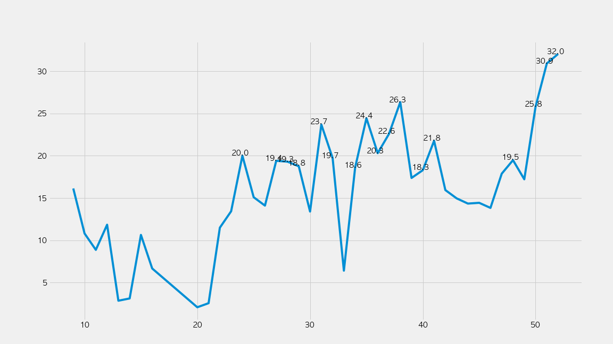
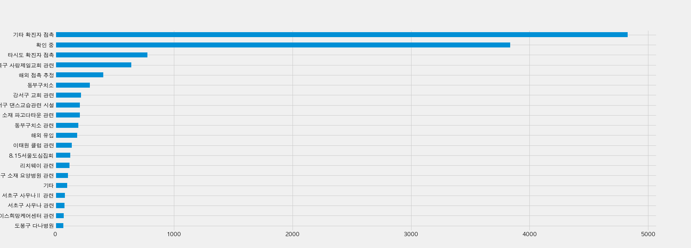

# Covid19 Unknown Spread in Seoul

## What's the trend of untracked Covid19 patients in Seoul?

* [Visualizing Seoul's untracked Covid19 patients out of daily confirmed cases. ](https://nbviewer.jupyter.org/github/snoop2head/covid19_unknown_spread/blob/master/track_unknown_paths.ipynb)
* [Wrangling dataset for LSTM forecast](https://nbviewer.jupyter.org/github/snoop2head/covid19_unknown_spread/blob/master/wrangle_for_forecast.ipynb)
* [Forecasting Seoul's Covid19 patients with LSTM, based on untracked_patients, number of infection paths, weekend, holiday data.](https://nbviewer.jupyter.org/github/snoop2head/covid19_unknown_spread/blob/master/forecast_seoul_covid19.ipynb)

## Proportion of Untracked Confirmed Cases

Weekly trend where x axis is week number and y axis is (untracked cases / total confirmed cases)

## Daily Trends of confirmed cases in Seoul

Total Confirmed Cases vs Untracked Confirmed cases

## Tracking where the patient caught Covid19 from

## Forecasting Future Confirmed Cases

## 특이사항: 8.15일 집회 이후 변한 코로나19 지표들

### 경로 불명 확진자 수 (node)

* 광복절 이전 4주 간 46명
* 광복절 이후 4주 간 499명

### 감염 경로 개수 (edge)

* 광복절까지 감염경로 170개
* 9월 10일 밝혀진 감염경로 약 603개
